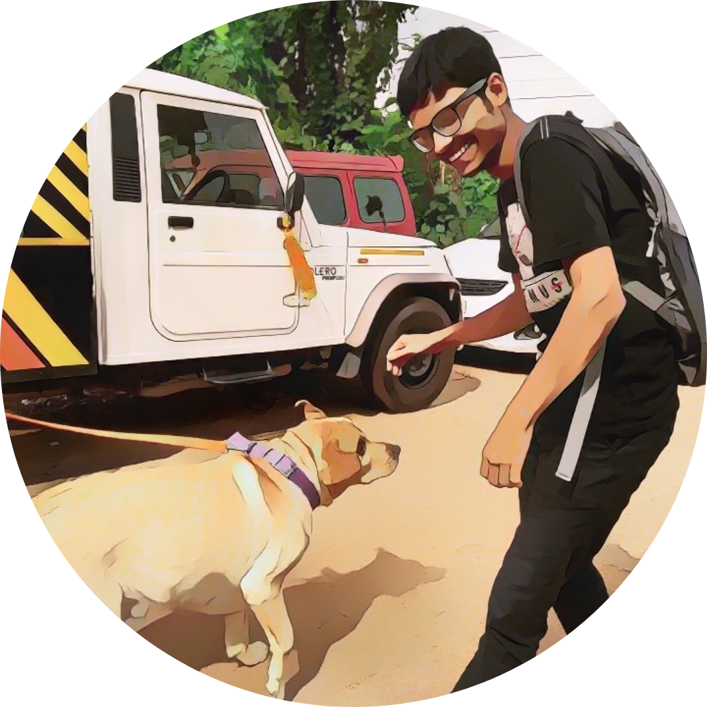

          Debagnik Kar - Electronics Engineer - Interactive Resume (function(w,d,s,l,i){w\[l\]=w\[l\]||\[\];w\[l\].push({'gtm.start': new Date().getTime(),event:'gtm.js'});var f=d.getElementsByTagName(s)\[0\], j=d.createElement(s),dl=l!='dataLayer'?'&l='+l:'';j.async=true;j.src= 'https://www.googletagmanager.com/gtm.js?id='+i+dl;f.parentNode.insertBefore(j,f); })(window,document,'script','dataLayer','GTM-K4THDHC');            (function() { window.\_\_insp = window.\_\_insp || \[\]; \_\_insp.push(\['wid', 2072583186\]); var ldinsp = function() { if (typeof window.\_\_inspld != "undefined") return; window.\_\_inspld = 1; var insp = document.createElement('script'); insp.type = 'text/javascript'; insp.async = true; insp.id = "inspsync"; insp.src = ('https:' == document.location.protocol ? 'https' : 'http') + '://cdn.inspectlet.com/inspectlet.js?wid=2072583186&r=' + Math.floor(new Date().getTime() / 3600000); var x = document.getElementsByTagName('script')\[0\]; x.parentNode.insertBefore(insp, x); }; setTimeout(ldinsp, 0); })();

[Badges](https://www.youracclaim.com/users/debagnik-kar/badges)

Debagnik Kar
============

Interactive Resumé

Toggle navigation

*   [Profile](#profile)
*   [Experiences](#experiences)
*   [Abilities](#abilities)
*   [Certificates](#certificates)
*   [Projects](#projects)
*   [Contact](#contact)

Profile
-------

I'm an Electronics and Telecommunication Engineer

* * *

### About me

I am an electronics and telecommunication engineering with keen interest in IoT, Cloud Computing and Web Technologies. I am also an embedded system developer with good knowledge in various programming languages such as C/C++, and Python 3. I love structure and order, and like to spend time in fixing little details. I am open-minded to new ideas, I like to collaborate in a team effort, it makes learning more fun and takes less time.

### Details

**Name:**  
Debagnik Kar  
**Age:**  
21 years(2021)  
**Location:**  
Patia, Bhubaneswar, Odisha, INDIA  

[Follow @DebagnikK](https://twitter.com/DebagnikK) ! function(d, s, id) { var js, fjs = d.getElementsByTagName(s)\[0\], p = /^http:/.test(d.location) ? 'http' : 'https'; if (!d.getElementById(id)) { js = d.createElement(s); js.id = id; js.src = p + '://platform.twitter.com/widgets.js'; fjs.parentNode.insertBefore(js, fjs); } }(document, 'script', 'twitter-wjs');

Experiences
-----------

“There are two things infinite in nature, The Universe and the human stupidity, I donno about the later. ”  
\- Sir Albert Einstien

* * *

### Education

#### KIIT School of Electronics Engineering

Apr 2022 (Currently pursuing)  
Jun 2018

**Course - B.Tech (Electronics and Telecommunication), GPA:7.82** B.Tech is an undergraduate academic degree conferred after completion of a 4 year programme of studies at an accredited University. In India B.Tech and B.Eng. are identical and is a 3 – 4 years of academic course depending on the previous level of education. Bhubaneswar, Odisha, India.

#### Midnapore Collegiate School

Apr 2016  
Jun 2018

**Course: WBCSHE-Science (HSE), GPA: 6.78** West Bengal Council of Higher Secondary Education is a state controlled council for Higher Secondary Education. I graduated HSE in science track which consists of the subjects Advanced Physics, Chemistry and Mathematics along with English and Bengali language and literature, with an optional elective, (Digital Electronics and Computer Science in my case). Midnapore, West Bengal, India

#### Dooars International Public School

May 2014  
Jun 2016

**Course: CBSE-Standard Secondary Education, GPA: 7.4** Central Board of Secondary Education is a council controlled by the union government of India and is responsible for conducting examination for HSE and SE students, It follows the curriculum provided by NCERT which included subjects like Science (physics, chemistry, biology), Mathematics, Social Sciences (Geography, History, Political Sciences and economics), English, Bengali, IT Fundamentals and Disaster management. Cooch Behar, West Bengal, India

### Careers

#### Digital Disruption, Singapore, PTE LTD

Jan 2021 - Mar 2021

**Intern**Machine Learning and Data Science research trainee  
During the Internship program, I was exposed and trained on Python Programming, Statistics, Machine Learning Models and Pipelines Techniques, Deep Learning Models, Artificial Intelligence and Data Science Research Remote Work | [Completion Letter](./trainingninternship/Internship/ddsg.png)

#### Texas Instruments University Programme

Jun 2020 - Jul 2020

**Intern**Embedded System Engineer  
Advanced Embedded System Design using Tiva C Series Microcontroller organized by EdGate Technologies Pvt Ltd Bangalore under Texas Instruments India University Program. Remote Work | [Completion Letter](./trainingninternship/Internship/tiuni.png)

#### KIIT Robotics Society

Aug 2019 - Jul 2020

**Instructor - IOT Classroom Program**I instructed build creative new projects to the young aspiring Engineers to find the solutions of real life problems using IOT technologies. At the same time I introduced the world of Linux and Git and Github. I taught them the use of APIs and how to smartly impliment them and how to use various cloud services. Bhubaneswar, Odisha, IN | [KIIT Robotics Society](https://ksac.kiit.ac.in/societies/kiit-robotics-society/)

#### KIIT Fest

Dec 2019 - Jan 2020

**Technical Member of Organising Commitee**Student Member of Organizing Committee for the school of electronic engineering, Technical department. I was primarily focused on the event line-clawers. Bhubaneswar, Odisha, IN | [KIIT Rewind](https://www.instagram.com/tv/CJeAjPJraer/?utm_source=ig_web_copy_link)

#### Futoscope Foundation

Dec 2018 - Dec 2020

**IT and Tech Support personnel**Fixing and maintaining the devices used in the organization, maintained the employee Database and servers. Midnapore, West Bengal, IN | [Completion Letter](./trainingninternship/Internship/ffmn.png)

#### MIT-IIT-Kgp Summer Intership (MISTI)

May 2017 - Jun 2017

**Intern**Exposed to various programming algotithms making 2D games and introduction to robotics and embedded systems Kharagpur, West Bengal, IN | [Instructor's Website](https://amartyashankha.github.io/teaching/)

Abilities
---------

“If you want to find the secrets of the universe, think in terms of energy, frequency and vibration.”  
\- Nikola Tesla (Author of my Inventions)

* * *

### Skills

*   Computer Programming
*   Embedded Systems
*   Internet of Things
*   Cryptography
*   Cybersecurity and ethical hacking
*   Computer Networking
*   Cloud Computing
*   Web Technologies
*   Database Management
*   Blockchain
*   IT and Tech Support

*   Operating Systems
*   Robotic Process Automation
*   Computer Simulation
*   Video Editing
*   Object Oriented Programming
*   SEO/SMO, DigiMarketing
*   Data Science and Analysis
*   Machine Learning
*   Version Control
*   VLSI Design
*   Digital Signal Processing

  

My project are mostly made public to Github, Have a look

[See projects on Github](https:github.com/Debagnik)

* * *

### Langauges

*   Bangla (Mother Tongue)
*   English (Daily Use)

*   Hindi (Can communicate)
*   Japanese (アニメから日本語を学びました)

### Tools

*   C/C++ (GCC/G++)
*   Python 3
*   Embedded C
*   Arduino IDE
*   Visual Studio Code
*   Kali-Linux
*   Cryptool 2
*   Cisco Packer Tracer
*   Amazon Web Services
*   Google Cloud Platform
*   MySQL
*   Redis
*   Blockchair
*   WindowsOS (XP to 10)
*   Microsoft Office Suite
*   Ubuntu OS (Desktop/Server)
*   Cent OS (Desktop/Server)
*   Real-Time OS (RTOS)

*   Robotics OS
*   UI Path
*   Cyberlink PowerDirector 18
*   Google analytics
*   Inspectlet
*   Notepad ++
*   MATLAB
*   Git/Github
*   HTML 5.0
*   CSS 3.0
*   JavaScript
*   Proteus Pro 8
*   Easy EDA
*   System Verilog
*   Processing 3 IDE (Java)
*   ATT M2X
*   ThinkSpeak
*   Wire Shark

Certificates
------------

“The Universe doesn't allow perfection”  
\-Stephen Hawkings

* * *

### UI Path: Robotic Process Automation Developer

This course provides an overview of the RPA Developer enablement journey and an introduction to the role

**Tags:**RPA, Automation

**Place:** Online - Coursera

[For more Information](https://academy.uipath.com/ContentLaunch?data=%2fuXWwt11k70Ir6ShSwnfsQ%3d%3d)

### ISOEH: Ethical Hacking and Cybersecurity

Introduction to netwoking and penetration testing, and exploit

**Tags:**Ethical Hacking, cyber security

**Place:** Online - Coursera

[For more Information](https://www.isoeh.com/)

### MATLAB Onramp

Fundamentals

**Tags:**Cloud computing, IoT, Embedded Systems

**Place:** Online - Coursera

[For more Information](https://matlabacademy.mathworks.com/progress/share/certificate.html?id=ea91588a-1fdb-4e3a-8004-68fa97387f1c)

### Python Specialization

University od Michigan: Python Specializatio

**Tags:**Python, Programming, SQL

**Place:** Online - Coursera

[For more Information](https://coursera.org/share/68fe45c537a8af888455370d691e61d6)

### IT Fundamentals for Cybersecurity

IBM IT Fundamentals for Cybersecurity Specialization

**Tags:**Cloud computing, IT, Cyber Security

**Place:** Online - Coursera

[For more Information](https://coursera.org/share/45ad83f7bade7e0ed46e24019e8590a8)

### Programming the IoT Specialization

University of California, Irvine Specialization in IoT Programming

**Tags:**Cloud computing, IoT, Embedded Systems

**Place:** Online - Coursera

[For more Information](https://coursera.org/share/51610f83d01556628535de53ad53c400)

### IT Support Professional

**Tags:**IT, WindowsOS, LinuxOS

**Place:** Online - Coursera

[For more Information](https://coursera.org/share/bd291e7dc3a3cf107f3097790df74775)

### Cybersecurity Analyst Specialization

IBM IBM Cybersecurity Analyst Specialization

**Tags:**Cloud computing, IoT, Embedded Systems

**Place:** Online - Coursera

[For more Information](https://coursera.org/share/29f15d7ddc388324669d20600dfc224f)

### IT Automation with Python Specialization

Google IT automation using Python with Git and Github and scripting

**Tags:**Python, IT

**Place:** Online - Coursera

[For more Information](https://coursera.org/share/41f43cb3ff5266ae3ed5ba2fe4e0ee55)

### AWS Fundamentals

Amazon AWS Fundamentals: Going Cloud Native

**Tags:**IT, AWS, Cloud Computing

**Place:** Online - Coursera

[For more Information](https://coursera.org/share/62dce2f51a50fd003e62c4d23ccbce67)

### IBM AI using WATSON

IBM AI using WATSON

**Tags:**Cloud Computer, Cyber security, AI

**Place:** Online - Coursera

[For more Information](https://coursera.org/share/8509b362105c1d70ff88a7fdd9c931f0)

### How Google does Machine Learning

Machine Learning on Google Cloud Platform

**Tags:**Google, ML, GCP

**Place:**Online - IICDC

[For more Information](https://coursera.org/share/51534c06a4df633d48b8269bf1082d49)

### Edgate & TI University

National Level contest conducted jointly by Indian Govt and Texas Intruments

**Tags: Programming**

**Place:** Online - IICDC

[For more Information](http://www.edgate.in/ti-university.php)

### Course for Ethical Hacking and cracking from Udemy

Visual Studio Code, Keyboards, pluglins and extentions

**Tags:**

**Place:** Online - Udemy

[For more Information](https://www.udemy.com/certificate/UC-6fcd9ec6-20f8-4759-9607-f62712d46ed7/)

Projects
--------

“An atom gets it's identity from it's proton and electron give it's personality”  
\- Bill Bryson, A short history of everything

* * *

Projects section is under Development  
More projects will be uploaded as soon as my college reopens

### Pong game Clone using Processing

2D Game clone of the classic arcade pong game for two players code and bin-exe are available here

**Tags:** Java, Game Dev, Processing

[Listen On Spotify](./projects/pong/readme.html)

### Doodle jump clone

2D Game clone of the classic arcade pong game for two players code and bin-exe are available here

**Tags:** Java, Game Dev, Processing

[Listen On Youtube](./projects/poodle_jump/readme.html)

### Ball on a plate balancing system

A touch sensitive plate balances a metal ball from falling using a PID Closed feedback loop

**Tags:** Arduino, PID, robotics

[readme](./projects/BallPlate_assignment/readme.html)

### Gesture controlled Land drone using accelerometer

A controller powered by an accelerometer and gyroscope which sense the change in the orientation of the controller and sends a signal to the rover wirelessly

**Tags:** Robotics, Embedded Systems

[readme](./projects/Gesture/readme.html)

### Home Automation Using IoT

Internet-connected device which switches on or off the electrical appliance in a room. It used the Adafruit MQTT dashboard for controlling the device and integrates with Google Assistance or Amazon Alexa using IFTTT.

**Tags:**IOT, Web Technologies

[readme](./projects/Home/readme.html)

### Smart Peril Avoidance and Advanced Driving Assistance System

The project is all about solving the problems faced by the driver while driving and thus providing them with advanced driving assistance.

**Tags:**Automotive safety, IoT

[readme](./projects/peril/readme.html)

### Portfolio Website for Debagnik Kar

Started as an side project, made using HTML, CSS, JS and Bootstrap framework. it contains my personal and professional infomation. Hosted in Github Pages and is closed sourced

**Tags:**HTML, Web Dev, Portfolio

[index.html](http://debagnik.github.io/Resume)

### Project Secure.ly

End-to-End Encrypted Chatting application for corporate to customer support

**Tags:**Cryptography, Networks, chatting

[Readme](./projects/secure.ly/readme.html)

### Music\_vix Set

Music Visualizer is a set of Processing3 codes which displays music responsive beautiful visuals. As of now, I have made 6 music visualizer with Processing3 and ddf/minim java audio Library.

**Tags:**fourier, DSP, Java

[Readme](./projects/Music_vix/readme.html)

### Chrome Dino Clone and Autoplayer using NEAT

A Clone of the famous arcade game Chrome-offline Dino Game and implimentation of Neural Evolutionary Augmenting Topology (NEAT). It at first releases 100 species in the game and the fittest species traits are passed on to the next generation helping the traits getting better with after each generation

**Tags:**Game Dev, NEAT, AI, Nueral Networks

[Readme](./projects/dino/readme.html)

[Visit my orcid](https://orcid.org/0000-0001-7320-5427)

Contact
-------

“You can't cross the ocean merely by standing and staring at the water  
\-Rabindranath Tagore, (Noble prize acceptance speech)

* * *

*    [ Follow on Instagram](https://www.instagram.com/rak_kingabed/)
*   [Connect using Linkedin](https://linkedin.com/in/debagnikkar)
*   [Explore my projects on Github](https://github.com/Debagnik)

*   [Subscribe me on Youtube](https://www.youtube.com/channel/UC5TJ5j8xY9f-LNT2TbQpttQ)
*   [Stream my music at Spotify](https://open.spotify.com/artist/5dFq7tR1ZJpQLnUvmS4oK5)
*   [Send an Email to me](mailto:1804373@kiit.ac.in)

* * *

©Debagnik Kar 2020  
Made with ❤ at KIIT

[go to top](#top)

#### Your browser is out of date

To get the best possible experience using our site we recommend that you upgrade to a modern web browser. To download a newer web browser click on the Upgrade button.

[Upgrade](https://browsehappy.com/)

var \_gaq = \_gaq || \[\]; \_gaq.push(\['\_setAccount', 'UA-168730436-1'\]); \_gaq.push(\['\_trackPageview'\]); (function() { var ga = document.createElement('script'); ga.type = 'text/javascript'; ga.async = true; ga.src = ('https:' == document.location.protocol ? 'https://ssl' : 'http://www') + '.google-analytics.com/ga.js'; var s = document.getElementsByTagName('script')\[0\]; s.parentNode.insertBefore(ga, s); })();
